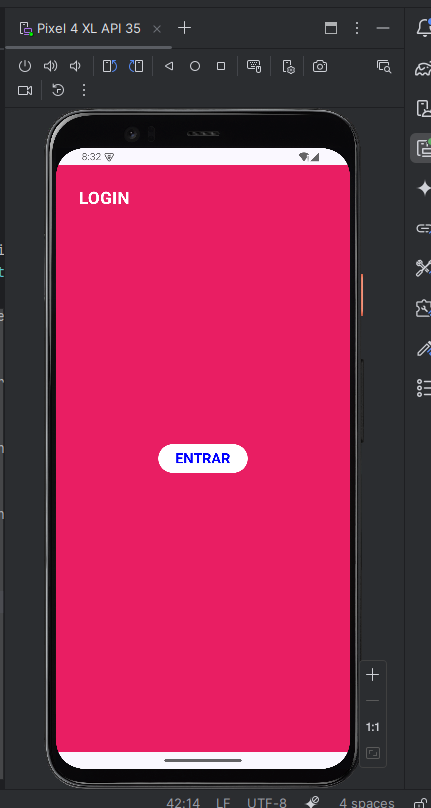
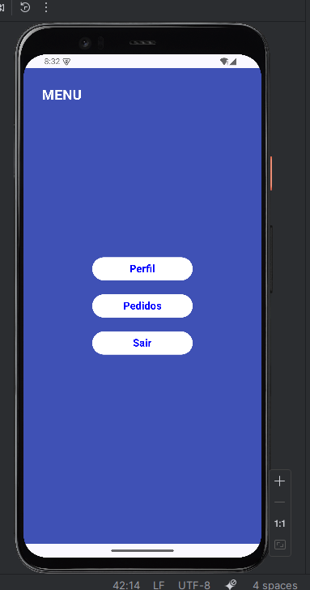
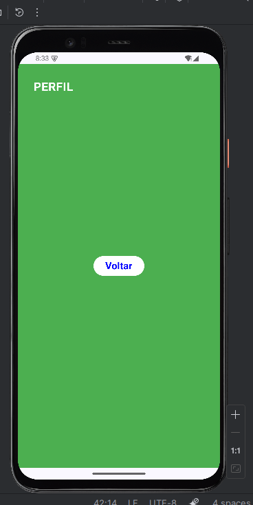
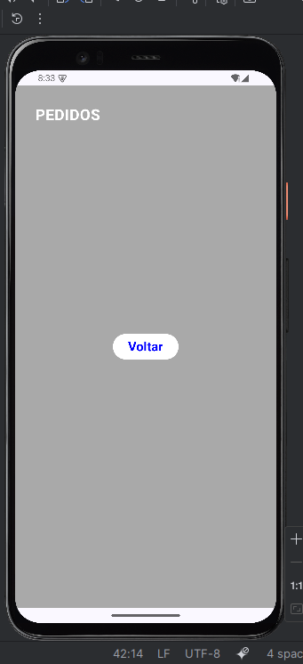

# Projeto de Navegação - Jetpack Compose

## 📝 Descrição do Projeto
Este projeto é um aplicativo Android desenvolvido em Kotlin utilizando Jetpack Compose. O objetivo principal é demonstrar a implementação de navegação entre diferentes telas utilizando a biblioteca `Navigation Compose`, configurando rotas e repassando o `NavController`.

O fluxo de navegação permite ir da tela de **Login** para o **Menu Principal**, e de lá acessar as telas de **Perfil** e **Pedidos**, mantendo a pilha de navegação correta para o funcionamento do botão de voltar.

## 📸 Prints do Aplicativo Funcionando

### Tela de Login

### Menu Principal

- O botão "Pedidos" no MenuScreen foi atualizado para passar explicitamente o valor `"Cliente XPTO"` ao parâmetro opcional

### Tela de Perfil

- A tela de Perfil, que antes recebia apenas `nome`, passou a receber também `idade` — dois parâmetros de tipos diferentes simultaneamente.
- A tela de Perfil passou a exigir dois parâmetros obrigatórios: `nome` (String) e `idade` (Int). Parâmetros obrigatórios são definidos diretamente no path da rota, entre chaves `{}`

### Tela de Pedidos

- A tela de Pedidos passou a aceitar um parâmetro opcional `cliente` via query string, com valor padrão definido.
